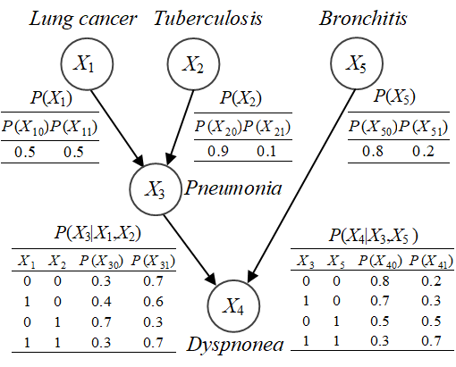
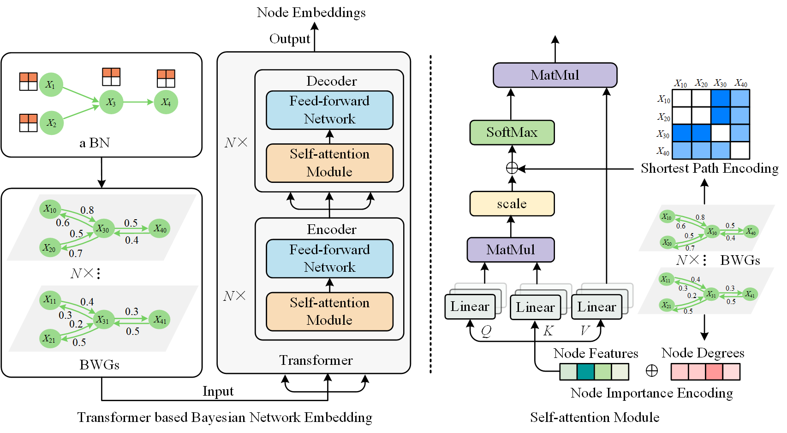

# Paper title: Transformer Based Bayesian Network Embedding for Efficient Multiple Probabilistic Inferences (CIKM 2024)
[Bayesian network (BN)](https://github.com/maryqizhiwei/M-TBNE/blob/main/BN.png) is a directed acyclic graph (DAG)  representing the dependence relations among random variables with conditional probability tables (CPTs). The efficiency and accuracy of multiple probabilistic inferences in BN could not be guaranteed by most of the existing approximate inference methods. To address this issue, we propose the methods of Transformer based BN embedding (TBNE) and TBNE based probabilistic inferences. Specifically, we first adopt mutual information to measure the weight of parent-child node pairs and transform BN into multiple bidirectional weighted graphs (BWGs), while preserving the DAG and CPTs. Then, we redesign the Transformer model by incorporating the node importance and shortest path encodings, and  extend the self-attention module of Transformer to generate node embeddings of BWGs. Following, we cast the probabilistic inference as the decoding information maximization of the path in BN from the perspective of information theory. Finally, we give an efficient algorithm for multiple probabilistic inferences by calculating embedding similarities between evidence and query nodes in BN. Experimental results show that our inference method is more efficient than the state-of-the-art competitors by several orders of magnitude while maintaining almost the same results.

<div align=center>

</div>

Our contributions are summarized as follows:
- We cast the probabilistic inference as the decoding information maximization of the path in BN from the perspective of information theory.
- We propose the Transformer based BN embedding method to generate node embeddings while preserving the DAG and CPTs.
- We propose the efficient method for multiple probabilistic inferences in BN by calculating embedding similarities between query and evidence nodes repeatedly.
- We present experimental results that our inference method is much faster than the state-of-the-art competitors, while maintaining almost the same results.

The framework of our M-TBNE includes TBNE and [TBNE](https://github.com/maryqizhiwei/M-TBNE/blob/main/fig1_BNTransformer_3.pdf) based multiple probabilistic inferences.
- We first construct the BWGs from a BN by calculating the mutual information of each node pair as the edge weight. To calculate the mutual information efficiently, we adopt FS to generate simulated samples from the given BN and count the eligible simulated samples.
- We then extend the self-attention module of Transformer to generate node embeddings by incorporating node importance and shortest path encodings, such the node attributes and structural relations in the BWGs could be captured.
- We finally perform multiple probabilistic inferences by calculating the embedding similarities, where each probabilistic inference is viewed as finding the shortest path from evidence nodes to query nodes by the decoding information principle.

<div align=center>

</div>

# Installation
- docker configuration
```
docker login --username=mckinleylu registry.cn-hangzhou.aliyuncs.com 
docker pull registry.cn-hangzhou.aliyuncs.com/attrisocialnetwork/tasn:latest
docker run --gpus all -itd --name UAI -p 2020:2020 registry.cn-hangzhou.aliyuncs.com/attrisocialnetwork/tasn
docker exec -it UAI bash
cd usr
mkdir project
cd project
git clone --recursive https://github.com/microsoft/Graphormer.git
```
- conda configuration
```
conda create -n P1 python=3.9
conda activate P1
cd Graphormer
python -m pip install --upgrade "pip==21.1"
bash install.sh
```
- requirement configuration
```
pip install requirement.txt
cd /Graphormer1/Graphormer/examples/property_prediction
bash test.sh
```
 download [requirement.txt](https://github.com/maryqizhiwei/M-TBNE/blob/main/requirement.txt)

# Reference
If you find our codes useful, please consider citing our work
```
@inproceedings{
kun2024transformer,
title={Transformer Based Bayesian Network Embedding for Efficient Multiple Probabilistic Inferences},
author={Kun Yue and Zhiwei Qi and Zhu Yang and Liang Duan},
booktitle={33rd ACM International Conference on Information and Knowledge Management},
year={2024},
url={https://doi.org/10.1145/3627673.3679860}
}
```
[1] Kun Yue, Zhiwei Qi, Zhu Yang, Liang Duan. Transformer based Bayesian network embedding for efficient multiple probabilistic inferences. In Proceeding of the 33rd ACM International Conference on Information and Knowledge Management, 2024, doi: [10.1145/3627673.3679860](https://doi.org/10.1145/3627673.3679860).
